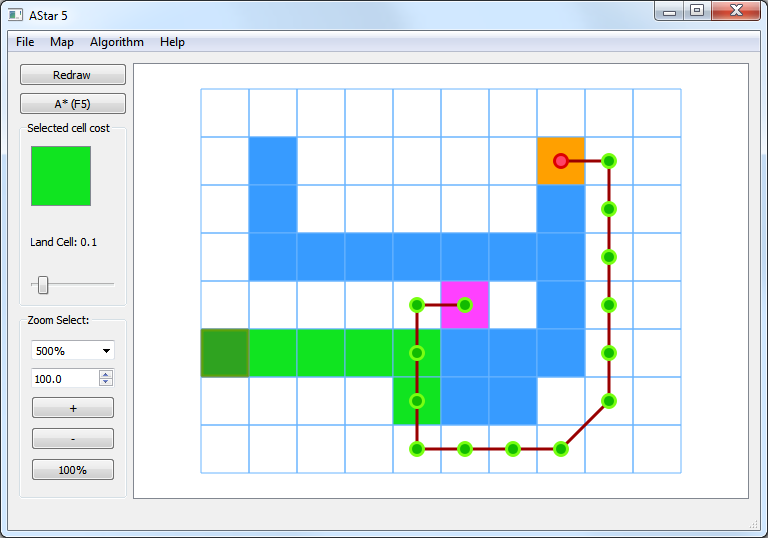
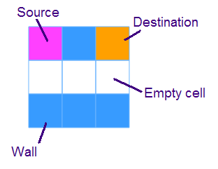

##AStar

### Description
A* path find sample with 2D map editor in Qt.

## Build instructions
* Clone source ```git clone git@github.com:okosan/AStar.git```
* Open Qt project file ```AStar.pro``` with Qt Creator (Qt 5.5 or higher is recommended)
* On Windows: ```Build->Build all``` should just work 
* Expected to build on Linux too, but wasn't tested recently.

## How to start
* Compile, build, run.
* Menu->File->Load and specify ```AStar\example_maps\simple1.map.txt```
* Press F5 and click on field to remove or add obstacles.



### Legend



## Actions and hotkeys
* Add obstacle - ```Left Click``` on a grid.
* Add source location - ```Shift + Left Click``` on a grid.
* Add destination location - ```Ctrl + Left Click``` on a grid.
* Select cell - ```Right Click``` on a grid.
* Deselect selection - ```Right Click``` outside of grid.
* Find path - ```F5```
* Load map from file - ```F3```
* Save map to file - ```F2```

### License
* MIT/GPL/LGPL license for `/pathfinder/*` (on choice).
* `/resources/*.png` is copyrighted images provided here for documentation purpose only.
* `/doc/*` is public domain.
* rest of sources - MIT/LGPL/GPL license for the demo sources and project (on choice).

